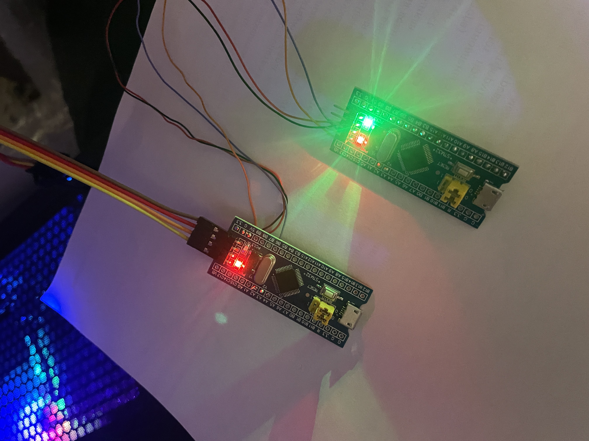

# Тема: Разработка программного обеспечения для конроллера велогибрида с поддержкой СМЕ (Лаборатоная работа 1)
## Изменения от лабораторной работы 0
В рамках данной лабораторной работы был реализован прототип связи между контроллерами на STM32. Были переписаны функции связи с использованием Event'ов.

## Async-runtime
Как и в нулевой лабораторной работе в качестве интерфейса связи между контроллерами был использован UART (universal asynchronous receiver-transmitter). Использование данного интерфейса подходит к требованиям лабораторной работы, так как это позволяет реализовать async-runtime.

Библиотека HAL, которая используется при написании кода для ктонтроллера STM32, позволяет сделать callback-функцию (событие) на принятие данных из UART. Для этого IDE создаёт weak-фукцию `HAL_UART_RxCpltCallback`, которую следует переопределить. Данная функция вызывается при окончании принятии данных.

Реализация callback-функции приёма данных из UART:
```
void HAL_UART_RxCpltCallback(UART_HandleTypeDef *huart) {
//    char _receivedData;
	if (huart == &huart2){
		HAL_UART_Receive_IT(&huart2, (uint8_t*)&receivedData, sizeof(status));
		ProcessReceivedData(receivedData); // Обрабатываем полученные данные
	}
}
```

В качестве индикатора приёма данных по UART был выбран способ "помигать светтодиодом"

Видно, что два ктонтроллера подключены между собой по проводам. Второй контроллер (что с зелёным светодиодом) принимает пакет данных от первого контроллера.

# Логирование (Пока не получлось)
Для создания логирования требуется настройка дополнительного UART интерфейса для обмена данными между контроллером и компьютером. Перенос функций на событийную архитектуру продолжается, так как для остальных функций требуется своё создание аналога Event'a.

## БД (DTO)
В данном проекте не предполагается использовать настоящую БД с СУБД, однако есть структура данных, которая является DTO и которой обмениваются контроллеры по UART.
```
struct status {
	uint16_t speed : 10;
	uint16_t brake : 10;
	uint8_t left : 1;
	uint8_t right : 1;
};
```
Как видно из структуры имеются чертыре переменные:

| Название переменной  | Описание | Тип данных |
| -------------------- | ------------- | ------------- |
| speed  | Показатель скорости  | `uint16_t` |
| brake  | Показатель тормозного усилия  | `uint16_t` |
| left  | Показатель работы левого поворотника  | `boolean` |
| right  | Показатель работы правого поворотника  | `boolean` |

Уточним, что `boolean` занимает 8 бит. Для экономии места в структуре этим двум логическим переменным были отведены по однму биту каждому.

## DockerFile (Не получилось)
В связи с тем, что данная программа, которую необходимо предварительно скомпилировать в бинарный файл, будет использоваться на микроконтроллере, использование контейнеров в виде DockerFile представляется маловозможным. Отметим, что по сути каждый контроллер является не только отдельным сервисом, но и отдельным контейнером в той или иной степени.

Справедливости ради стоит отметить, что сама возможность реализации контейнеров в полноценном значении этого слова реальна. Однако для этого потребуется к каждому контроллеру подключить ещё один контроллер с выходом в интернет, который будет принимать новую версию прошивки, компилировать в бинарный файл и загружать через программатор.

## Кулстори
В процессе отладки программы я никак не мог понять, почему не передавались данные между контроллерами. По коду ошибок не было, даже подключил GPT для помощи.

Как оказалось, ошибка была в "четвёртом измерении": я не туда припаял провода. На поиск данного деффекта ушло 16 часов(.
