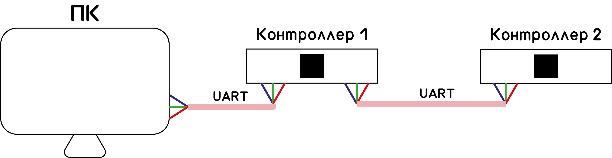
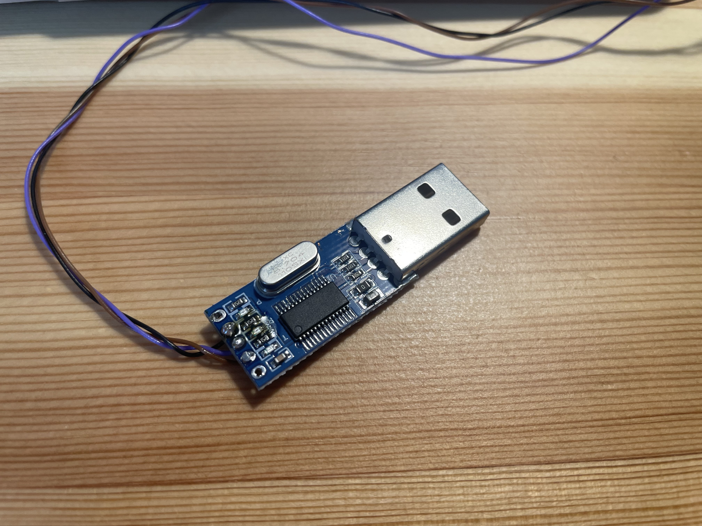

# Тема: Разработка программного обеспечения для конроллера велогибрида с поддержкой СМЕ (Лаборатоная работа 2)
## Предыдущие лабораторные работы
- [Лабораторная работа 0](README00.md)
- [Лабораторная работа 1](README01.md)
## Последующие лабораторные работы
- [Лабораторная работа 3](README.md)
## Оглавление
- [Структура связи](#структура-связи-пакет)
- [API](#api)
- [Функции отправки-приёмки пакетов](#реализация-функций-на-отправку-и-принятие-данных)
- [Добавление третьего контроллера](#третий-контроллер-в-системе)
- [To be (стенд)](#тестовый-стенд-to-be)
- [To be (логгировнаие)](#логгирование-to-be)
## Изменения от лабораторной работы 1
В связи со спецификой данного проекта все требования данной лабораторной работы были выполнены заранее. В рамках данной лабораторной работы будет освещено то, как реализованы эти трабования.

## Структура связи (пакет)
### Статус
Входимые параметры:
- Скорость (целочисл.)
- Тормозное усилие (целочисл.)
- Работа левого поворотника (логическое)
- Работа правого поворотника (логическое)
## API
### Общий вид передачи данных API
```
00|00|0|0|0x(00)|00
```
Следующий порядок расположения данных:
1) Конечная точка / код контроллера в системе (диапазон 0-256 [00-FF])
2) Начальная точка / код контроллера в системе (диапазон 0-256 [00-FF])
3) Код команды (диапазон 0-16 [0-F])
4) Длина передаваемых данных в байтах (диапазон 0-16 [0-F])
5) Передаваемые данные
6) Контрольная сумма (диапазон 0-256 [00-FF])
### Ответ принят (0)
Вид данных:
```
xxxx01xxx
```
Пояснение:
Запрос посылается отправителю для подтверждения получения другого запроса
В данных передаётся код обработаннйо команды

### Уведомление о подключении (1)
Вид данных:
```
00FF11xxxx
```
Пояснение:
Запрос посылается ведущему контроллеру с информацией о типе подключаемого контроллера (0 - ведущий, 1 - ведомый, 2 - прочее)

### Ответ об подключении (2)
Вид данных:
```
FF0021xxxx
```
Пояснение:
Запрос посылается отправителю с номером (id) контроллера в сети

### Уведомление об отключении (3)
Вид данных:
```
00xx30xx
```
Пояснение:
Запрос посылается ведущему контроллеру с уведомлением об отлючении

### Запрос на получение состояния (4)
Вид данных:
```
FE0040xx
```
Пояснение:
Запрос посылается всем ведомым контроллерам о получении состояния

### Ответ на запрос о состоянии (5)
Вид данных:
```
00xx53xxxxxxxx
```
Пояснение:
Ответ посылается при получении запроса о состоянии

Передаваемые данные:
- Значение скорости (диапазон 0-1024) [10 бит]
- Значение тормозного усилия (диапазон 0-1024) [10 бит]
- Состояние левого поворотника (диапазон 0-1) [1 бит]
- Состояние правого поворотника (диапазон 0-1) [1 бит]
2 бита в запасе

### Уведомление о изменении целевых показателей (6)
Вид данных:
```
FE0063xxxxxxxx
```
Пояснение:
Передача данных об изменении целевых показателей

Передаваемые данные:
- Целевое значение скорости (диапазон 0-1024) [10 бит]
- Целевое значение тормозного усилия (диапазон 0-1024) [10 бит]
- Работа левого поворотника (диапазон 0-1) [1 бит]
- Работа правого поворотника (диапазон 0-1) [1 бит]
2 бита в запасе

### Ответ на стороне произошла ошибка (F)
Вид данных:
```
xxxxF1xxxx
```
Пояснение:
Запрос посылается отправителю для уведомления об ошибке при обработке запроса
В данных передаётся код обработаннйо команды

## Реализация функций на отправку и принятие данных
Реализация callback-функции приёма данных из UART:
```
void HAL_UART_RxCpltCallback(UART_HandleTypeDef *huart) {
//    char _receivedData;
	if (huart == &huart2){
		HAL_UART_Receive_IT(&huart2, (uint8_t*)&receivedData, sizeof(status));
		ProcessReceivedData(receivedData); // Обрабатываем полученные данные
	}
}
```

Отрпавка происходит через функцию-обёртку:
```
void SendData(const Status data) {
    while (HAL_UART_Transmit_IT(&huart2, (uint8_t*)&data, sizeof(Status)) == HAL_BUSY);
}
```

## Третий контроллер в системе
В ТЗ есть требование, что необходимо как минимум 3 микросервиса. Вспомним, что в первой лабораторной работе было только два контроллера, которые обменивались пакетами данных между собой.  
В качестве третьего микросервиса будет вступать компьютер. Его роль в данной системе будет в качестве монитора для присылаемых данных с первого контроллера.


Примечание: так как в новых компьютерах не ставят COM-порты (UART для контроллера), то требуется специальный переходник.


## Тестовый стенд (to be)
До сегодняшнего дня макет был спаян "навестным монтажем", однако после случая, когда чудом удалось избежать короткого замыкания, было принято решение о перепайке компонентов на макетную плату.  
В случае, если бы стенд коротнул, то с немалой вероятностью рабочий компьютер пришёл бы в негодность, что недопустимо.

## Логгирование (to be)
Так как в третьей лабораторной работе есть требование о логгирований, то в данной системе предусмотрен задел на отправку данных на компьютер не по вышеупомянутому API. Это стало возможным потому, что первый контроллер общяется с компьютером по второму UART, который может быть настроен независимо от первого UART'а.

На стороне компьютера полученные данные будут записываться в файл.